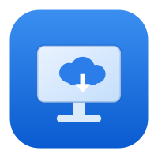
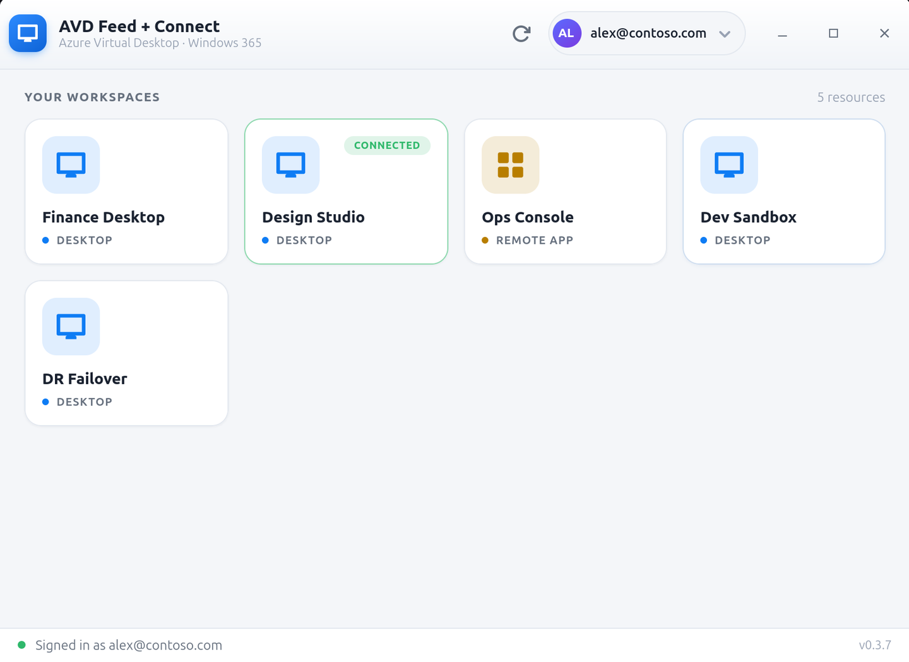

<p align="center">
  
</p>

<h1 align="center">AVD Feed + Connect (Linux)</h1>

<p align="center">
A native Linux client for <b>Azure Virtual Desktop</b> and <b>Windows 365</b> —
sign in, see the desktops and remote apps you're entitled to (just like
Microsoft's Windows App), and connect over RDP.
</p>

> Unofficial. Not affiliated with or endorsed by Microsoft.

## Screenshots

<p align="center">
  
  <br>
  <em>Your Azure Virtual Desktop workspaces, discovered automatically after sign-in.</em>
</p>

## Why

Linux has FreeRDP, but no client that does **feed discovery** — the step where
you sign in and the client lists your AVD workspaces instead of you
hand-authoring an `.rdp`/`.rdpw` file per host pool. This app adds that, and
drives a bundled, hardened FreeRDP for the actual connection.

## How it works

1. **Interactive Entra ID sign-in** (auth-code + PKCE, in an embedded WebKit
   view). This is the same flow the official clients use, so Conditional Access
   policies that block the device-code flow are honored.
2. **Feed discovery** against `rdweb.wvd.microsoft.com/api/arm/feeddiscovery`
   (sending the approved `X-MS-User-Agent` the service requires).
3. **Workspace grid** with the real per-resource icons; double-click to connect.
4. **Connect** by downloading the resource's `.rdp` from the feed and launching
   the bundled `sdl-freerdp` with `/gateway:type:arm /sec:aad`.

Token refresh is the standard OAuth2 `refresh_token` grant (offline_access);
the app renews the access token silently before it expires.

## The bundled FreeRDP matters

The Flatpak bundles a FreeRDP build with two things stock upstream lacks:

- **Pulse hot-unplug + rdpsnd busy-loop fixes** ([FreeRDP#13334](https://github.com/FreeRDP/FreeRDP/pull/13334)) —
  without these, changing the audio device mid-call (e.g. plugging headphones
  during a Teams call) **freezes the whole session**.
- **Camera redirection** (`CHANNEL_RDPECAM_CLIENT`), plus microphone and
  multi-monitor.

## Install

[](https://github.com/shakeelosmani/avd_feed_connect/releases/latest)

**Easiest — one click / one command** (from the signed repo on GitHub Pages):

👉 **[Install (avd_feed_connect.flatpakref)](https://shakeelosmani.github.io/avd_feed_connect/avd_feed_connect.flatpakref)**

Opening that file installs the app through GNOME Software / your Flatpak handler.
Or from a terminal:

```bash
flatpak install --user https://shakeelosmani.github.io/avd_feed_connect/avd_feed_connect.flatpakref
flatpak run io.github.shakeelosmani.avd_feed_connect
```

This adds a small signed remote so the app also **updates** with
`flatpak update`. The GNOME 49 runtime is pulled from Flathub automatically.

**Alternative — single-file bundle** from the
[latest release](https://github.com/shakeelosmani/avd_feed_connect/releases/latest):

```bash
flatpak install --user avd_feed_connect.flatpak
```

*(A Flathub listing is planned; until then, use either method above.)*

### Build it yourself

```bash
flatpak install flathub org.gnome.Platform//49 org.gnome.Sdk//49 org.flatpak.Builder
flatpak run org.flatpak.Builder --user --install --force-clean build-dir \
  io.github.shakeelosmani.avd_feed_connect.yml
flatpak run io.github.shakeelosmani.avd_feed_connect
```

## Run unpackaged (development)

The same code runs without Flatpak if you have PyGObject (Gtk 3.0, WebKit2 4.1)
and an SDL3 `sdl-freerdp` on `PATH` (or at `~/opt/freerdp-sdl3-cam/bin/`):

```bash
python3 src/avd_feed_gui.py           # GUI
python3 src/avdfeed.py list           # CLI: list workspaces
python3 src/avdfeed.py connect 0      # CLI: connect to resource 0
```

Override the tenant/account with `AVD_TENANT` / `AVD_UPN`, and the client binary
with `AVD_SDL_FREERDP`.

## Status

Early. Feed discovery, sign-in, the workspace grid, and connect are working. The
Flatpak manifest is complete but still needs a first clean `flatpak-builder` run
(the FreeRDP module has the most external deps). Contributions welcome.

## License

MIT for this app's code. Bundled components keep their own licenses (FreeRDP:
Apache-2.0, SDL: Zlib).
